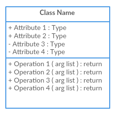
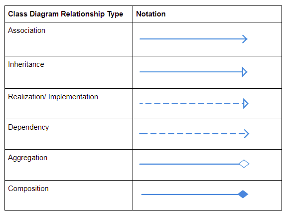
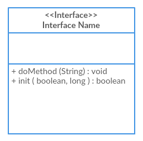
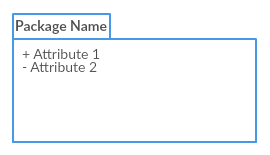

### 🤔 **¿Qué es un diagrama de clases UML?**

Un **diagrama de clases UML** es una representación visual de la estructura estática de un sistema orientado a objetos. Muestra las clases del sistema, sus atributos, métodos y las relaciones entre ellas. Es fundamental para comprender y diseñar la arquitectura de software.

---

### 📌 **Componentes clave de un diagrama de clases UML**

- **Clases**: Representadas por rectángulos divididos en tres compartimentos:
  - **Nombre de la clase**: En la parte superior.
  - **Atributos**: Características o propiedades de la clase.
  - **Métodos (Operaciones)**: Comportamientos o funciones que la clase puede realizar.



- **Relaciones**:
  - **Asociación**: Conexión entre clases que indica una relación.
  - **Herencia (Generalización)**: Una clase hija hereda atributos y métodos de una clase padre.
  - **Agregación**: Relación "tiene un", donde una clase contiene a otra, pero ambas pueden existir independientemente.
  - **Composición**: Relación fuerte de "parte de", donde la existencia de una clase depende de la otra.
  - **Dependencia**: Una clase utiliza o depende de otra para funcionar.



- **Interfaz**:
  - **<`<Interfaz>`>**: En la parte superior, indica que es una `Interface`.
  - **Nombre**: En la parte superior indica el nombre de la interfaz.
  - **Atributos**: Suele quedar vacío.
  - **Métodos**: Los métodos que desarrolla la clase.
  - **Realización o Implementación (Implements)**: Una clase que implementa la interfaz se conectará a la interfaz con una línea discontinua y una flecha hueca. **[Interfaces UML](https://www.ibm.com/docs/en/rational-soft-arch/9.6.1?topic=diagrams-interfaces)**.



- **Paquetes**:
  - **Nombre**: El nombre del paquete.
  - **Importación de paquete**: Indica que los elementos públicos de un paquete están disponibles para otro. Se representa con una línea discontinua con una flecha abierta apuntando hacia el paquete importado.
  - **Fusión de paquete**: Combina dos paquetes, fusionando sus contenidos. Se representa con una línea discontinua con una flecha abierta apuntando hacia el paquete que se va a fusionar. **[Paquetes UML](https://www.geeksforgeeks.org/package-diagram-introduction-elements-use-cases-and-benefits/)**



---

### 🎯 **¿Para qué sirve un diagrama de clases UML?**

✅ **Modelar la estructura del sistema**: Define cómo se organizan y relacionan las clases.

✅ **Identificar relaciones y dependencias**: Facilita la comprensión de cómo interactúan las diferentes partes del sistema.

✅ **Planificar la implementación**: Sirve como guía para los desarrolladores durante la codificación.

✅ **Comunicar el diseño**: Proporciona una visión clara para todos los stakeholders del proyecto.

---

### 🚀 **Guía paso a paso para crear un diagrama de clases UML**

#### **1️⃣ Identificar las clases principales**

📍 **¿Qué entidades forman parte del sistema?**

- Piensa en los objetos clave que el sistema debe manejar.

💡 **Ejemplo**: En un sistema de gestión de biblioteca, las clases podrían ser "Libro", "Usuario", "Préstamo".

---

#### **2️⃣ Definir atributos y métodos de cada clase**

📍 **¿Qué características y comportamientos tiene cada clase?**

- **Atributos**: Propiedades que describen la clase (e.g., título, autor).
- **Métodos**: Funciones que la clase puede realizar (e.g., prestar(), devolver()).

💡 **Ejemplo**: La clase "Libro" podría tener atributos como "título" y "autor", y métodos como "prestar()" y "devolver()".

---

#### **3️⃣ Establecer relaciones entre clases**

📍 **¿Cómo interactúan las clases entre sí?**

- **Asociación**: Relación general entre clases.
- **Herencia**: Una clase deriva de otra.
- **Agregación**: Una clase contiene a otra, pero ambas pueden existir por separado.
- **Composición**: Una clase contiene a otra, y la existencia de la contenida depende de la contenedora.
- **Dependencia**: Una clase utiliza a otra para realizar una función.

💡 **Ejemplo**: Un "Usuario" puede tener múltiples "Préstamos".

---

### 📌 **Diferencias clave entre Agregación y Herencia (`extends`)**

Es importante aclarar que en UML, la **agregación** y la **herencia** (representada por `extends` en lenguajes como Java) son conceptos distintos, aunque ambos describen relaciones entre clases.

#### 🧩 **Agregación (Relación "tiene un")**

- **Definición**: Es una forma de asociación que indica que una clase contiene a otra como parte de su estructura, pero ambas pueden existir independientemente.
- **Ejemplo**: Una clase `Equipo` que contiene una lista de objetos `Jugador`. Si se elimina el `Equipo`, los `Jugador` pueden seguir existiendo.
- **Representación en UML**: Una línea con un rombo blanco en el extremo de la clase contenedora.  **[Diagrama de clases](https://es.wikipedia.org/wiki/Diagrama_de_clases)**.

#### 🧬 **Herencia (`extends`) (Relación "es un")**

- **Definición**: Una clase hija hereda atributos y métodos de una clase padre, estableciendo una relación jerárquica.
- **Ejemplo**: Una clase `Usuario` que extiende de una clase `CrudGenerico`, heredando sus métodos para operaciones CRUD.
- **Representación en UML**: Una línea sólida con una punta de flecha sin rellenar apuntando hacia la clase padre.  **[Relaciones de diagramas de clases en UML explicadas con ejemplos](https://creately.com/blog/es/diagramas/relaciones-de-diagrama-de-clases-uml-explicadas-con-ejemplos/)**.

#### 🧠 **Analogía para entender la diferencia**

- **Agregación**: Piensa en una **biblioteca** que contiene **libros**. La biblioteca "tiene" libros, pero los libros pueden existir fuera de la biblioteca.
- **Herencia**: Considera un **automóvil** que es un tipo de **vehículo**. Aquí, el automóvil "es un" vehículo y hereda sus características.

---

#### **4️⃣ Aplicar notaciones UML**

📍 **¿Cómo representar visualmente las clases y sus relaciones?**

- Usa rectángulos para las clases, divididos en tres secciones: nombre, atributos y métodos.
- Representa las relaciones con líneas y símbolos específicos:
  - Línea sólida para asociación.
  - Flecha con triángulo vacío para herencia.
  - Rombo vacío para agregación.
  - Rombo relleno para composición.
  - Línea discontinua con flecha para dependencia.

---

#### **5️⃣ Utilizar herramientas de diagramación**

📍 **¿Qué herramientas puedes usar para crear el diagrama?**

- **[Lucidchart](https://www.lucidchart.com/pages/es/tutorial-de-diagrama-de-clases-uml)**
- **[Draw.io](https://app.diagrams.net/)**
- **[Creately](https://creately.com/blog/es/diagramas/tutorial-de-diagrama-de-clases/)**

Estas herramientas ofrecen plantillas y símbolos UML para facilitar la creación de diagramas.

---

### 🔐 **Símbolos de visibilidad en UML**

En los diagramas de clases UML, los símbolos como `+`, `-`, `#` y `~` se utilizan para indicar la **visibilidad** de los atributos y métodos de una clase. Esta notación es esencial para representar cómo los elementos de una clase pueden ser accedidos desde otras partes del sistema, promoviendo así el principio de encapsulamiento en la programación orientada a objetos. **[UML Class Diagrams: All you need to know - JointJS](https://www.jointjs.com/blog/uml-class-diagrams?utm_source=chatgpt.com)**.

| Símbolo | Visibilidad                         | Acceso permitido a...                                             |
| -------- | ----------------------------------- | ----------------------------------------------------------------- |
| `+`    | **Pública** (`public`)     | Cualquier clase. Desde cualquier lado                             |
| `-`    | **Privada** (`private`)     | Solo la propia clase. Dentro de la misma clase                    |
| `#`    | **Protegida** (`protected`) | La clase y sus subclases (herencia) |
| `~`    | **De paquete** (`package`)  | Clases dentro del mismo paquete o módulo                         |

#### **1️⃣ Ejemplo práctico**

Imagina una clase `Usuario` con los siguientes atributos y métodos:

```ts
+nombre: String
-contraseña: String
#email: String
~fechaRegistro: Date

+iniciarSesion(): boolean
#validarEmail(): void
-cifrarContraseña(): String
~actualizarFechaRegistro(): void
```

- `+nombre`: Es accesible desde cualquier parte del sistema y sus instancias.
- `-contraseña`: Solo puede ser accedida dentro de la clase `Usuario` y nada más.
- `#email`: Puede ser accedida por la clase `Usuario` y por una clase que la herede.
- `~fechaRegistro`: Es accesible por clases dentro del mismo paquete.

#### **2️⃣ Importancia de la visibilidad**

Utilizar correctamente estos modificadores de visibilidad ayuda a:

- **Encapsular** los datos, protegiendo la integridad del objeto.
- **Controlar** el acceso a los miembros de la clase, evitando usos indebidos.
- **Facilitar** el mantenimiento y la evolución del código al tener interfaces claras.

Por ejemplo, al marcar un atributo como `private`, se asegura que solo métodos internos de la clase puedan modificarlo, lo que previene cambios inesperados desde otras partes del sistema. **[Acceso a miembros protegidos en JAVA](https://www.geeksforgeeks.org/accessing-protected-members-in-java/)**.

#### **3️⃣ Consejo práctico**

Al diseñar tus clases: **[Visibility notation in UML class diagrams](https://softwareengineering.stackexchange.com/questions/311549/visibility-notation-in-uml-class-diagrams?utm_source=chatgpt.com)**

- Utiliza `private` para atributos que no deben ser modificados directamente desde fuera de la clase.
- Emplea `protected` cuando esperas que subclases necesiten acceder o modificar ciertos miembros.
- Aplica `public` solo a aquellos métodos o atributos que deben estar disponibles para otras clases.
- Considera `package` (`~`) cuando trabajas en sistemas donde la organización en paquetes es relevante y deseas limitar el acceso a ciertas clases dentro del mismo paquete.

Este enfoque promueve un diseño más robusto y alineado con los principios de la programación orientada a objetos.

---

### 🧠 **Trucos para simplificar la creación de diagramas de clases UML**

- 🔹 **Empieza con lo esencial**: Identifica primero las clases y relaciones más importantes.
- 🔹 **Utiliza nombres claros y descriptivos**: Facilita la comprensión del diagrama.
- 🔹 **Evita la sobrecarga de información**: No incluyas todos los detalles en un solo diagrama; es mejor dividir en partes si es necesario.
- 🔹 **Revisa y valida**: Asegúrate de que el diagrama refleje correctamente los requisitos y funcionalidades del sistema.

---

### 🔗 **Recursos adicionales**

- **[Video tutorial sobre diagramas de clases UML (el mejor video)](https://www.youtube.com/watch?v=6XrL5jXmTwM&list=PLUoebdZqEHTxpGCwKrb82cIvHNoNaBb4R&index=4)**
- **[Tutorial de diagrama de clases UML - Lucidchart](https://www.lucidchart.com/pages/es/tutorial-de-diagrama-de-clases-uml)**
- **[La Guía Fácil de los Diagramas de Clases UML | Tutorial - Creately](https://creately.com/blog/es/diagramas/tutorial-de-diagrama-de-clases/)**
- **[Guía completa para entender el diagrama de clases UML básico](https://boardmix.com/es/knowledge/class-diagram/)**
- **[Diagrama de clases: Qué es, cómo hacerlo y ejemplos | Miro](https://miro.com/es/diagrama/que-es-diagrama-clases-uml/)**
- **[What is Class Diagram? - Visual Paradigm](https://www.visual-paradigm.com/guide/uml-unified-modeling-language/what-is-class-diagram/?utm_source=chatgpt.com)**

---

### 🎯 **Conclusión**

Los diagramas de clases UML son herramientas esenciales para modelar la estructura de sistemas orientados a objetos. Al identificar correctamente las clases, sus atributos, métodos y relaciones, se facilita la comprensión, diseño y mantenimiento del software. Utilizar notaciones estándar y herramientas adecuadas asegura una comunicación efectiva entre todos los involucrados en el proyecto.
